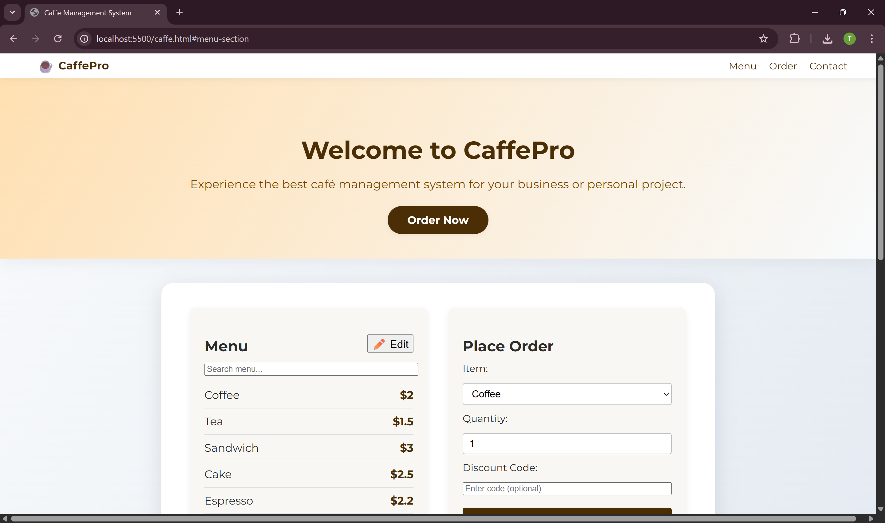

# CafeConnect

## Project Description
CafeConnect is a professional, web-based café management system. It allows users to browse a dynamic menu, place orders, apply discounts, view order history, and more—all in a modern, responsive interface. The project is ideal for learning web development and for small café businesses looking for a digital solution.

## Features
- Editable menu (add/remove items, change prices)
- Order history (session-based)
- Discount code/coupon support
- Light/dark mode toggle
- Print or download order receipt
- Search/filter menu items
- Responsive, modern UI

## Technologies Used
- HTML5
- CSS3
- JavaScript 

## Screenshots

### Dashboard

### Order Here

### Contact Us

## Contact

- 💼 LinkedIn: [https://www.linkedin.com/in/taranjot13](https://www.linkedin.com/in/taranjot13)
- 📧 Email: [65taranjot@gmail.com](mailto:65taranjot@gmail.com)
- 🐙 GitHub: [https://github.com/Taranjot13](https://github.com/Taranjot13)

## Author
Created by Taranjot Singh

